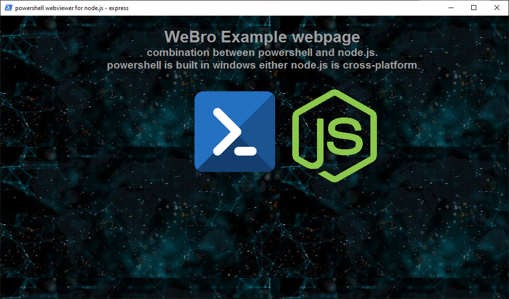

<h1 align="center">WeBro</h1>

This program is an example of how to use powershell as GUI Web Browser named as WeBro, you don't need a browser with a high processes like Chrome, edge, etc... WeBro is open source also this idea is for web dev that needs to make a GUI using their skills in web dev.

##### Usage: 
I expect that you have already installed the git brush on your windows also the node.js

​		`git clone https://github.com/git-shad/webro.git`

​		`npm run show`

------

